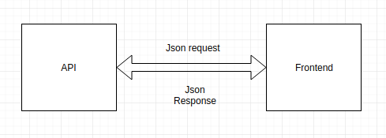
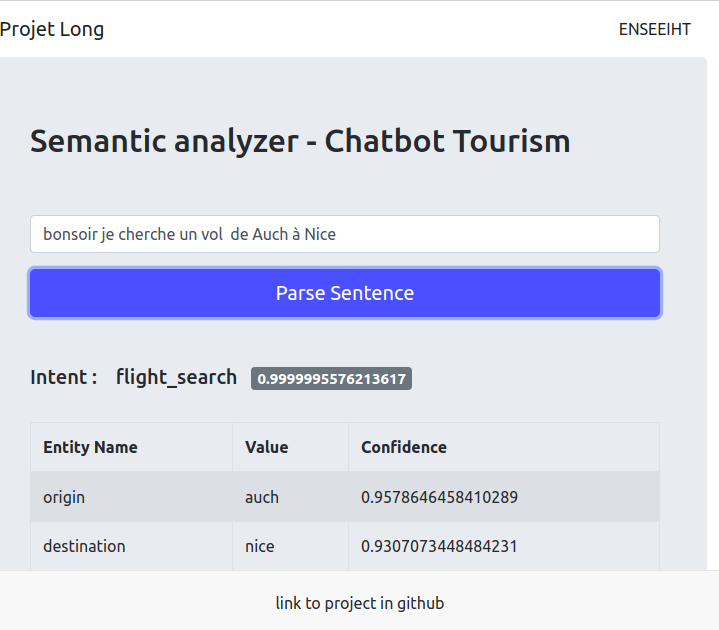

# Fronted of the APi
 The goal of this frontend project is to interact our API and display results in  a graphical interface.

## Project architecture
The fronted send Json request contains the message to the API.
and receive json response that contains the aim or target of the user message (Intent) 
and the useful information of the message that can be extracted (Entities).
After that we display this response.



## Getting Started
### Prerequisites
- You need to install nodeJs v8.10.0 or later and npm v3.5.2 or later on unix machine.
nodeJs and npm can be installed as follows
```
sudo apt-get install nodejs npm
```
### Requirements
To install the dependencies in the local node_modules folder
```
npm install
```

To create a production build, you should run this command
```
npm run build
```
### Configuration
Before run the code, you should specify some parameters in the file **config.js**  as follows
```
let config = {
    url: "http://localhost:5000/api/parse",
    token: "hwvTzW7FJTwEA4XTVNxkWRApa0srOQYu"
};

module.exports = config;
```

- **url** : MongoDB URI (in our case  URI connection string for connecting to the Atlas cluster )
- **token** : Path to the folder of rasa model 


### Running project

you can run this project as follows
```
npm start
```

**output:**
```
Compiled successfully!

You can now view frontend in the browser.

  Local:            http://localhost:3000/
  On Your Network:  http://192.168.1.75:3000/
```




### Autors

- Ismail Moussaoui
- Amine Charifi
- Othmane El Fetnassi
- Youssef Bendagha
- M'hand Glilah
- Marouane Labyad 


